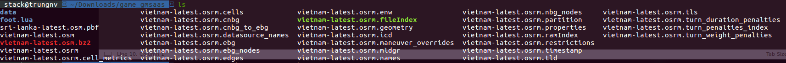
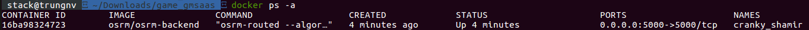
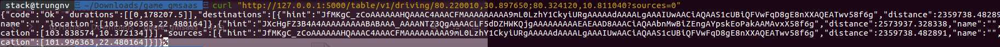
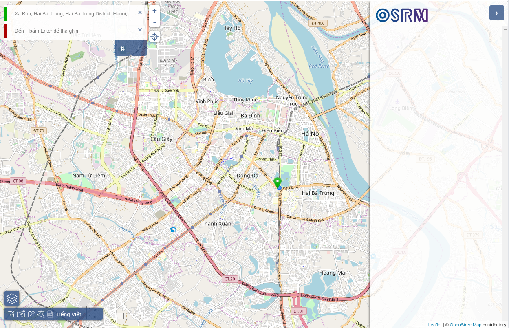

## 1. How to install and use OSRM backend?

### 1.1 Why we should use OSRM instead of Google Maps.

Currently, API of Google maps only support for a response from request, thus we must futher add money for many requests in production. Thus, a OSRM solution is open-source project which help for personal projects (mobile/ web) or small projects without add more money.

### 1.2 OSRM solution.

OSRM is Open Source Routing Machine.

<B><U>Step 1</U></B>: Download maps: http://download.geofabrik.de/index.html

```
Note: - Use ``.osm`` file
      - docker-hub: https://hub.docker.com/r/osrm/osrm-backend/
      - Github link: https://github.com/Project-OSRM/osrm-backend
```

<B><U>Step 2</U></B>: Get Vietnam osm data from Geofabrik website
```bash
$wget http://download.geofabrik.de/asia/vietnam-latest.osm.bz2  # For Vietnam
```
<B><U>Step 3</U></B>: Extract maps data via docker command
```bash
$docker run -t -i -p 5000:5000 -v "${PWD}:/data" osrm/osrm-backend osrm-extract -p /opt/car.lua /data/vietnam-latest.osm
```


<B><U>Step 4</U></B>: Run partition and customize along with other containers
```bash
$docker run -t -i -v $(pwd):/data osrm/osrm-backend osrm-partition /data/vietnam-latest.osrm

$docker run -t -i -v $(pwd):/data osrm/osrm-backend osrm-customize /data/vietnam-latest.osrm
```
<B><U>Step 5</U></B>: Launch a routed map server (online map server)
```bash
$docker run -t -i -p 5000:5000 -d -v $(pwd):/data osrm/osrm-backend osrm-routed --algorithm mld /data/vietnam-latest.osrm

$docker ps -a
```


<B><U>Step 5</U></B>: Check running osrm map server



## 2. Build OSRM front-end.
```bash
$docker run -p 9966:9966 osrm/osrm-frontend
```

Result:



Let's enjoy with OSRM !!!

Author: [Nguyen Van Trung](https://github.com/trungnvfet) - IRC: trungnv
