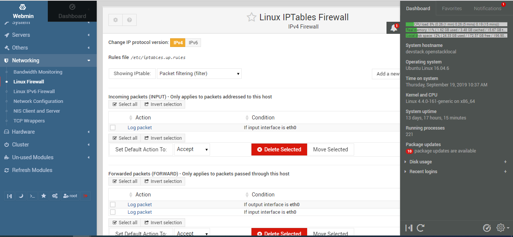
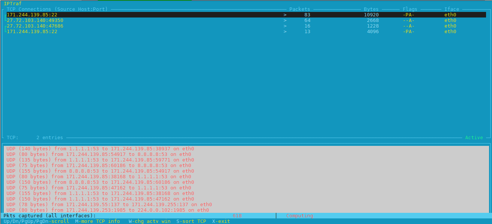
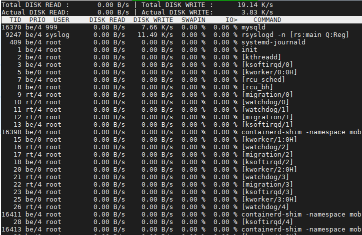
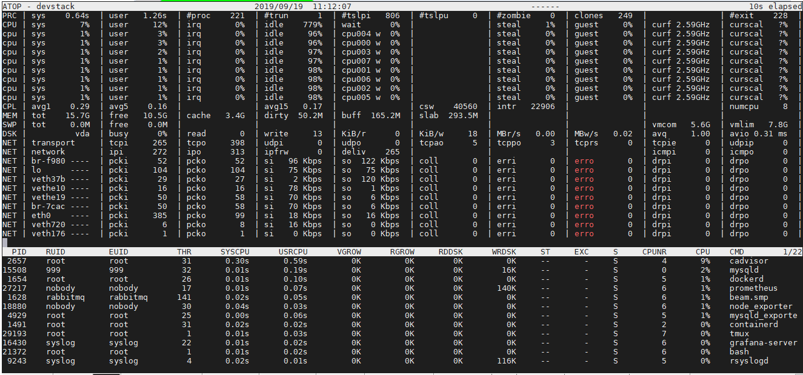
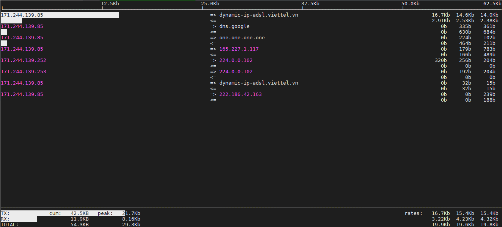
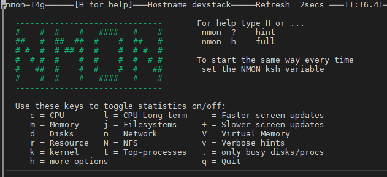
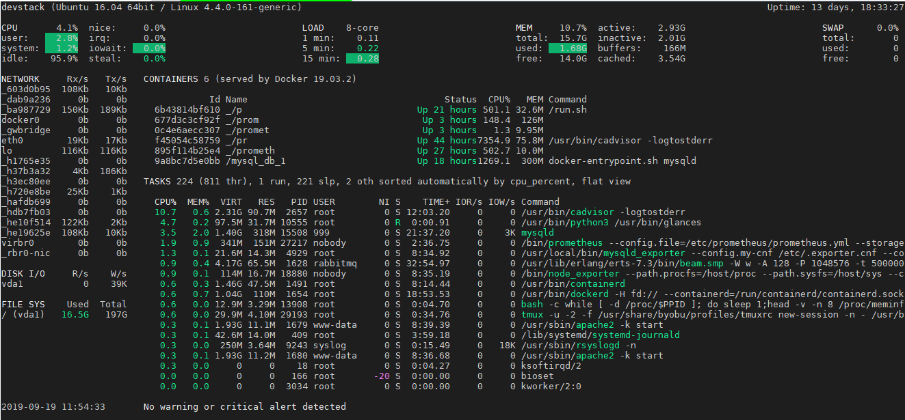

1. Vmstat: Hiển thị  thông tin về vi xử lý, bộ nhớ RAM, CPU, I/O 
root@devstack:~# vmstat
    ```bash
    procs -----------memory---------- ---swap-- -----io---- -system-- ------cpu-----
    r  b   swpd   free   buff  cache   si   so    bi    bo   in   cs us sy id wa st
    1  0      0 10897440 169188 3826816    0    0     0     2    4    0  0  0 100  0  0
    ```

2. top: Hiển thị thông tin giám sát các tiến trình xử lý trên Linux
root@devstack:~# top
    ```bash
    top - 10:56:24 up 13 days, 17:35,  3 users,  load average: 0.18, 0.30, 0.24
    Tasks: 221 total,   1 running, 220 sleeping,   0 stopped,   0 zombie
    %Cpu(s):  0.2 us,  0.1 sy,  0.0 ni, 99.6 id,  0.0 wa,  0.0 hi,  0.0 si,  0.0 st
    KiB Mem : 16431680 total, 11073208 free,  1375292 used,  3983180 buff/cache
    KiB Swap:        0 total,        0 free,        0 used. 14478780 avail Mem

        PID USER      PR  NI    VIRT    RES    SHR S  %CPU %MEM     TIME+ COMMAND
        409 root      20   0   43620  14980  14636 S   6.2  0.1   3:47.93 systemd-journal
        7962 root      20   0   42224   3832   3184 R   6.2  0.0   0:00.01 top
        1 root      20   0   37992   6056   4016 S   0.0  0.0   0:37.05 systemd
    ```

3. Webadmin: Giao diện quản trị dễ dàng cho người sử dụng
Webmin install complete. You can now login to https://devstack:10000/


4. PS: Chi tiết thêm các thông tin của các tiến trình đang xử lý trên linux
root@devstack:~# ps -aux
    ```bash
    USER       PID %CPU %MEM    VSZ   RSS TTY      STAT START   TIME COMMAND
    root         1  0.0  0.0  37992  6056 ?        Ss   Sep05   0:37 /sbin/init
    root         2  0.0  0.0      0     0 ?        S    Sep05   0:00 [kthreadd]
    root         3  0.0  0.0      0     0 ?        S    Sep05   0:03 [ksoftirqd/0]
    root         5  0.0  0.0      0     0 ?        S<   Sep05   0:00 [kworker/0:0H]
    root         7  0.0  0.0      0     0 ?        S    Sep05   4:55 [rcu_sched]
    root         8  0.0  0.0      0     0 ?        S    Sep05   0:00 [rcu_bh]
    root         9  0.0  0.0      0     0 ?        S    Sep05   0:05 [migration/0]
    root        10  0.0  0.0      0     0 ?        S    Sep05   0:06 [watchdog/0]
    ```

5. Pmap: Giám sát cho từng PID (process ID)
    
    ```bash
    root@devstack:~# pmap 25117

    25117:   sshd: root@pts/0
    0000562388f0f000    756K r-x-- sshd
    00005623891cc000     12K r---- sshd
    00005623891cf000      4K rw--- sshd
    00005623891d0000     36K rw---   [ anon ]
    000056238a8be000    592K rw---   [ anon ]
    00007efc85236000     12K r-x-- pam_env.so
    00007efc85239000   2044K ----- pam_env.so
    00007efc85438000      4K r---- pam_env.so
    00007efc85439000      4K rw--- pam_env.so
    00007efc8543a000     20K r-x-- pam_limits.so
    ```

6. Netstat: Sử dụng cho network, liệt kê các TCP connection, bảng định tuyến và các network interfaces
    
    ```bash
    root@devstack:~# netstat -anpl | grep :8080

    tcp        0      0 172.20.0.1:50840        172.20.0.3:8080         ESTABLISHED 2496/docker-proxy
    tcp6       0      0 :::8080                 :::*                    LISTEN      2496/docker-proxy
    tcp6       0      0 171.244.139.85:8080     172.20.0.5:33992        ESTABLISHED 2496/docker-proxy
    ```

7. Iostat: Giám sát CPU load và ở đĩa
    
    ```bash
    root@devstack:~# iostat

    Linux 4.4.0-161-generic (devstack)      09/19/2019      _x86_64_        (8 CPU)

    avg-cpu:  %user   %nice %system %iowait  %steal   %idle
                0.23    0.00    0.12    0.01    0.01   99.63

    Device:            tps    kB_read/s    kB_wrtn/s    kB_read    kB_wrtn
    vda               0.78         0.63        14.01     744239   16636512
    ```

8. Mpstat: Giám sát tài nguyên cho đa lõi CPU
    
    ```bash
    root@devstack:~# mpstat

    Linux 4.4.0-161-generic (devstack)      09/19/2019      _x86_64_        (8 CPU)

    11:08:49 AM  CPU    %usr   %nice    %sys %iowait    %irq   %soft  %steal  %guest  %gnice   %idle
    11:08:49 AM  all    0.23    0.00    0.12    0.01    0.00    0.00    0.01    0.00    0.00   99.63
    ```

9. iptraf: Thu thập các đặc tính của Mạng và hiển thị giao diện trực quan lưu lượng TCP/UDP
    ```bash
    root@devstack:~# iptraf
    ```
    

10. tcpdump: Phân tích gói tin TCP/IP và các gói khác

11. Iotop: Công cụ giám sát I/O (Dựa trên ngôn ngữ Python)

    

12. htop: Hiển thị trực quan và nhiều tính năng hơn ``top`` CLI

13. atop: Công cụ hiển thị CPU, RAM, Disk và Network

    

14. iftop: Công cụ giám sát Mạng và băng thông

    

15. nmon: Hiển thị và ghi thông tin hệ thống nội bộ

    

16. glances: Viết bằng python và thu thập thông tin và CPU, Network, Tải, RAM

    

17.  bmon: Hiển thị và ghi thông tin hệ thống

     


<B>Kết lại cho phần I và Chờ đợi Phần II .... </B>
