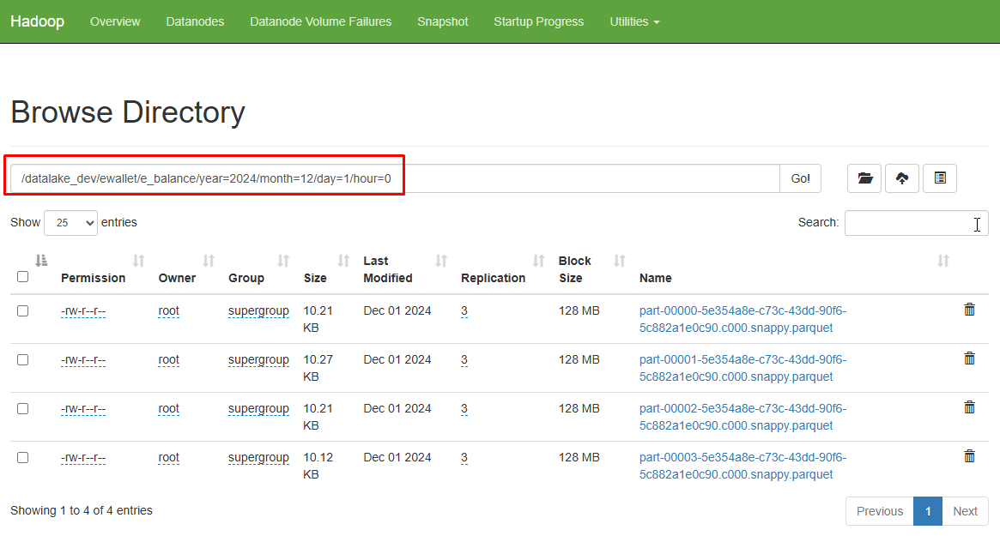

## How to change a timezone on the Spark jobs

### Purpose

This is a trivial skill to keep the data on the `Hadoop`, which will be migrating through the `Spark` jobs along with the Vietnamese timezone (UTC+7)

### Issue

In this blog, I used `pyspark` of Python code to perform an ELT mechanism into Hadoop storage. The flow encountered an issue with the timezone on the hour column, which affected my business logic to store partition data on Hadoop. The partition is going to locate the structure in the following:

```bash
folder structure:
  year
    month
      day
        hour
```


This flow should be going to `hour=14`, but I got `hour=7` as the following:
```bash
|    id |user_id|year|month| day|hour|
+-------+-------+----+-----+----+----+
|      1|      1|2025|    1|  1 |   7|
+-------+-------+----+-----+----+----+
```

### Solution

In the my blog, I deployed Spark and Hadoop on the Virtual Machine (VM) along with system services. Therefore, I need to update the timezone on the VM in the following commands:
```bash
[root@datawarehouse ~]# timedatectl set-timezone Asia/Ho_Chi_Minh
[root@datawarehouse ~]# timedatectl
      Local time: Wed 2025-01-01 14:22:16 +07
  Universal time: Wed 2025-01-01 07:22:16 UTC
        RTC time: Wed 2025-01-01 07:22:16
       Time zone: Asia/Ho_Chi_Minh (+07, +0700)
     NTP enabled: no
NTP synchronized: yes
 RTC in local TZ: no
      DST active: n/a

=> Time zone: Asia/Ho_Chi_Minh (+07, +0700)
```

Then perform Stop & Start Spark services on the VM:
```bash
$ cd $HOME/Spark/spark-3.5.1-bin-hadoop3/sbin
$ ./stop-all.sh
$ ./stop-connect-server.sh

$ ./start-all.sh
$ ./start-connect-server.sh --packages org.apache.spark:spark-connect_2.12:3.5.1
```

### Outcome

Perform the ELT mechanism again with the Python code and got a result as following:

```bash
|    id |user_id|year|month| day|hour|
+-------+-------+----+-----+----+----+
|      1|      1|2025|    1|  1 |  14|
+-------+-------+----+-----+----+----+
```


</B>KeepTheSimpleWays !</B>

## References
* stackoverflow
* openapi
